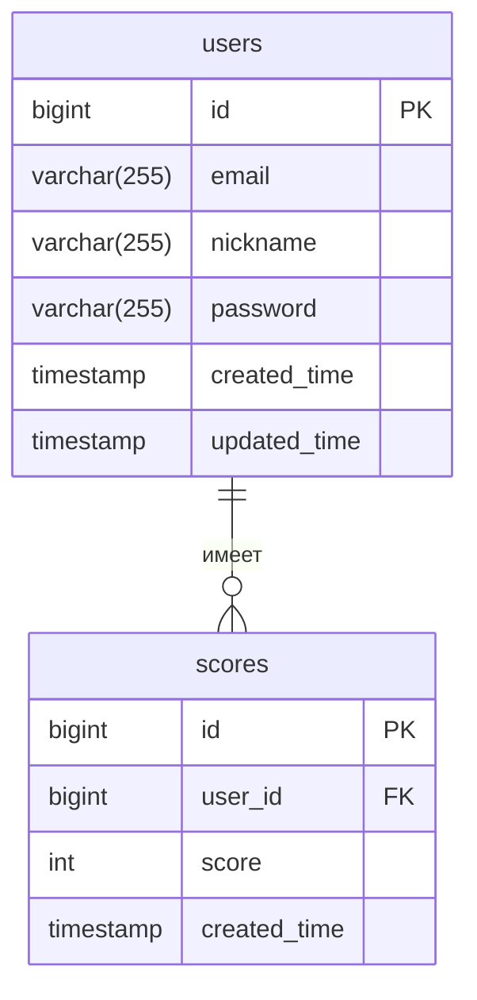

# Тетрис онлайн
*Находится на этапе разработки

*Веб-игра с многопользовательским доступом и рейтинговой системой*


## 🌟 Основные функции

### 👤 Работа с пользователями

- ✅ Регистрация и вход по email + пароль (JWT)
- 🧾 Получение профиля (`/profile`)
- 🚪 Выход (очистка токена на клиенте)

---

### 🎮 Логика игры

- 🎲 Запуск тетриса с уровнями и очками
- 💾 Отправка результата игры на сервер (`/submit-score`)
- 🏅 Проверка на рекорд и сохранение в таблицу очков

---

### 🏆 Лидерборд

- 📊 Получение топа игроков (`/leaderboard`)
- 👤 Позиция текущего пользователя в топе
- 🕓 История игр пользователя

---

### 📬 Оповещения по почте

- ✉ Приветственное письмо при регистрации
- Оповещение о смещении с первого места

---

## Технологический стек
| Категория       | Технологии                                    |
|----------------|-----------------------------------------------|
| **Бэкенд**     | go 1.24.2, Gin, sqlx, JWT, bcrypt, log, Kafka |
| **Базы данных**| PostgreSQL, golang-migrate                    |
| **Инфраструктура** | Docker, Docker Compose                        |

---

## 📊 Схема базы данных



---

## API Документация
[

---
## 🐳 Развертывание
### 1. Клонируйте репозиторий:
```bash
git clone https://github.com/AnakoHda/tetris_game_online
cd brick_game_online
```
### 2. Создай файл окружения `.env` в корень проекта:
```bash
touch .env
```
### 3. Заполни переменные окружения :
*Вставь шаблон в `.env` и заполни своими значениями после `=`*
```bash
DB_USER=      # имя пользователя базы данных
DB_PASSWORD=  # пароль пользователя
DB_NAME=      # название базы данных
DB_HOST=      # имя сервиса базы данных в docker-compose (по умолчанию: postgres)
DB_PORT=      # порт для подключения к БД (по умолчанию: 5432)
MAIL_USERNAME=# email для отправки уведомлений
MAIL_PASSWORD=# пароль приложения (не аккаунта!)
JWT_SECRET=   # секретный ключ для создания токенов
```
### 4. Запуск приложения:
```bash
docker-compose up --build
```
---
## 📧 Контакты
- Автор: Новичков Павел
- 📧 Email: novichkov199@yandex.ru
- 💻 GitHub: https://github.com/AnakoHda